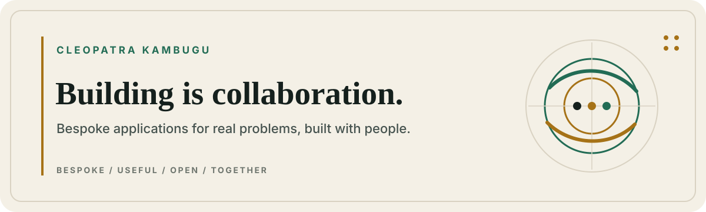

<!--
  Public profile draft prepared 2026-08-31.
  Status labels reflect evidence reviewed on that date.
  Do not describe prototypes as deployed products or publish private source by implication.
-->

  <picture>
    <source media="(prefers-color-scheme: dark)" srcset="./assets/profile-header-dark.svg">
    <source media="(prefers-color-scheme: light)" srcset="./assets/profile-header-light.svg">
    
  </picture>

  <strong>Applied systems for culture, access, public-interest infrastructure, and safer AI.</strong> 
  Useful first. Free-first where practical. Built with people.

  <a href="#product-ecosystems">Product ecosystems</a> ·
  <a href="https://github.com/users/cleokambugu/projects/1">Roadmap</a> ·
  <a href="#more-systems-we-are-building">More systems</a> ·
  <a href="#the-lab-behind-the-work">The lab</a> ·
  <a href="#collaborate">Collaborate</a>

## Hello, I'm Cleopatra.

I turn complicated, real-world needs into working software and decision systems. The work moves across African media, grantmaking, creation tools, public-interest intelligence, privacy, safety, and AI governance.

I say **we** deliberately. These systems grow through collaboration with users, communities, domain practitioners, designers, engineers, researchers, and AI tools working under human direction. The work has moved through ChatGPT, Claude, Codex, Replit, local models, and the web—but the thread connecting it is human purpose and accountable building.

`LIVE` reachable now · `PREVIEW` access-gated · `RELEASE CANDIDATE` locally verified, public operations gated · `PROTOTYPE` working build · `RESEARCH` active exploration · `PRIVATE` not publicly offered

## Product ecosystems

### Tazama — watching, listening, and personal media

Tazama is a rights-aware, Africa-first media family built around a simple idea: watching and listening are better when people can discover, gather, and participate without losing sight of creators, publishers, consent, or source rights.

| Product | Role | State |
| --- | --- | --- |
| **[Tazama Watch](https://tazama-watch.xulaye.chatgpt.site/)** | Curator-led discovery, private social rooms, authorised sources, public-interest media, and first-party experiences. | `LIVE` |
| **[Tazama Listen](https://tazama-watch.xulaye.chatgpt.site/)** | The integrated listening layer: live radio, podcasts, public television, music discovery, and source-aware audio experiences inside Tazama. | `LIVE` |
| **Tazama Personal** | A local media vault and player for media a person controls, with private discovery and experience experiments. | `PROTOTYPE` |
| **GAIA by Tazama** | A procedural nature-soundscape instrument with transparent controls and no health claims. | `PROTOTYPE` |

### The AI operating-system family

Here, **operating system** means a coordinating product layer for human–AI work—not a device kernel and not one autonomous or sentient service.

| System | Role | State |
| --- | --- | --- |
| **Nalongo OS** | The voice, presence, and conversational layer designed to connect Tazama with the wider AI ecosystem. | `PRIVATE PROTOTYPE` |
| **Sage OS** | A voice-first productivity and coordination interface designed to organise work across ChatGPT and the broader AI ecosystem. | `PRIVATE PROTOTYPE` |
| **Cleo OS** | The continuity and intelligence architecture: context, preferences, privacy boundaries, permissions, skills, and integrations carried across AI workspaces. | `PRIVATE INFRASTRUCTURE` |
| **Model Room · Claude Bridge · AgentGPT Bridge** | Auditable handoffs, bounded multi-model collaboration, and reusable local agent profiles supporting the OS family. | `PRIVATE INFRASTRUCTURE` |

These layers have moved through ChatGPT, Claude, Codex, Replit, and local models at different times. The shared direction is continuity with explicit permissions; public status is never inferred from a prototype or an old workspace link.

## More systems we are building

| System | Purpose | State |
| --- | --- | --- |
| **Nexus GMS** | A locally verified, synthetic-data grant-management prototype for intermediary funders: braided allocations, configurable decisions, reporting gates, compliance, and donor attribution. | `PRIVATE PROTOTYPE` |
| **Ingia** | A privacy-first moment finder that identifies an indexed film and its exact moment from a short clip. | `PROTOTYPE` |
| **Fundi** | A local-first app studio that unifies visual edits and model edits in one validated interface specification, then exports to React. | `PROTOTYPE` |
| **Bandwidth** | An advisory practice and systems lab for equitable grantmaking, fund and mechanism design, participatory philanthropy, and organisational strategy. | `RELEASE CANDIDATE` |
| **Aegis Security Platform** | A local-first defensive security platform. Its current Command Center turns read-only Windows telemetry into clear evidence, status, and operator-owned decisions. | `PRIVATE PROTOTYPE` |
| **FIRSTLIGHT** | Decision intelligence for time-bound travel and public-policy opportunities: catalyst, pricing lag, traveller economics, deadlines, and invalidation. | `RESEARCH` |
| **[Uganda Opportunity Map](https://uganda-opportunity-map.xulaye.chatgpt.site/)** | Source-linked opportunity intelligence connecting cases to budgets, payers, capital wedges, triggers, and stop conditions. | `PREVIEW` |

The wider [portfolio atlas](./PORTFOLIO.md) connects the products, experiments, research, and infrastructure behind them. The public [Portfolio Roadmap](https://github.com/users/cleokambugu/projects/1) offers a compact, evidence-labelled view of the current systems.

## The lab behind the work

| Layer | Systems | What it contributes |
| --- | --- | --- |
| **Contextual reasoning** | Uwingi | An alpha language and runtime experiment for contextual values, plural answers, provenance, consent, and ternary truth. |
| **Market research** | Goose · Aegis Maestro · AI Trading Council | Paper and synthetic-market research with risk controls, evidence gates, and multiple perspectives. No live trading, investment advice, or verified performance claims. |
| **Search intelligence** | Tafuta Q | A local-first search-intent studio with explicit open, found, and unknown evidence states. |

Research and experience design also include **CONVENE Strategy Adventure**, the **UG-ACT** warning-to-action blueprint, an **AI Rogue governance study** focused on bounded action and failure containment, and the **Y.E.A.R. / S.T.A.Y. / R.E.P.E.A.T. / V.A.L.U.E.** decision frameworks.

## Why we build

Some systems began as tools we needed ourselves. Others emerged from problems that deserve better infrastructure. Each starts specific, then becomes more useful through use, critique, translation, testing, and shared knowledge.

We aim to keep public apps and sites free to use wherever practical. At this stage, **useful adoption matters more than collecting a tiny payment from every person**. When compute, storage, bandwidth, voice, media relay, or another service creates a real recurring cost, we support the cost-bearing layer through transparent pricing, sponsors, or institutional partnerships while keeping the core path open wherever practical.

Traffic is useful when it becomes participation: people arrive, solve something, return, and help the work improve.

## How we build

**Context before assumption** · **Rights before reach** · **Evidence before claims** · **Local-first when practical** · **Verification before release**

Accessibility, privacy, safety, rollback, and operational ownership are product features. A polished interface matters; so does knowing what the system can prove, what remains uncertain, and who is authorised to act.

## Collaborate

Use something. Question it. Report what broke. Bring domain knowledge. Translate it. Document it. Design it. Code it. Fund a public-interest layer. Or bring a problem worth solving.

Collaboration can begin before a pull request. **The more the merrier.**

**[Propose a collaboration](https://github.com/cleokambugu/cleokambugu/issues/new?template=collaboration.yml)** · **[Report a public bug](https://github.com/cleokambugu/cleokambugu/issues/new?template=public-bug.yml)** · **[Read the contribution guide](./CONTRIBUTING.md)**

## Working toolkit

`TypeScript` `React` `Next.js` `Python` `Cloudflare` `progressive web apps` `media pipelines` `voice interfaces` `local AI` `MCP` `security engineering` `product strategy`

---

  Bespoke applications. Open doors. Shared progress.

